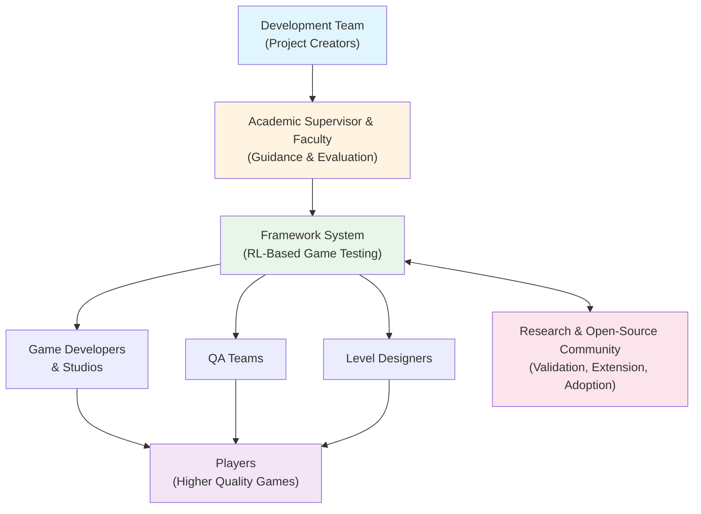

## 1.5. Stakeholders

This section identifies the key stakeholders involved in or affected by the automated game quality assurance framework project.

### Stakeholder Categories

**Primary Stakeholders (Direct Involvement)**

1. **Development Team**
   - Role: Design, implement, test, and document the framework
   - Interest: Successful project completion, skill development in RL and software engineering

2. **Academic Supervisor (Prof./Dr. Mohamed Taher)**
   - Role: Provide guidance, review deliverables, evaluate project quality
   - Interest: Academic rigor, research contribution, student learning outcomes

3. **Faculty Review Committee**
   - Role: Assess deliverables and implementation against graduation requirements
   - Interest: Project meets academic standards and demonstrates technical competency

**Direct Beneficiaries**

4. **Game Developers & Studios**
   - Role: Potential adopters of the framework for production QA workflows
   - Interest: Reduced testing time, objective difficulty metrics, automated bug detection
   - Scope: Indie developers, AA/AAA studios, procedural content generation teams

5. **QA Teams & Testers**
   - Role: End-users of the framework; integration into existing QA pipelines
   - Interest: Augmentation of manual testing capabilities, faster iteration cycles

6. **Level Designers**
   - Role: Consumers of difficulty metrics and bug reports
   - Interest: Data-driven design decisions, rapid quality feedback during iteration

**Secondary Stakeholders**

7. **Research Community**
   - Role: Validate methodology, replicate experiments, extend to other domains
   - Interest: Reproducible results, open-source access, academic publication potential

8. **Open-Source Community**
   - Role: Contribute extensions (Unity/Unreal adapters), report issues, improve documentation
   - Interest: Accessible codebase, clear documentation, modular architecture

**Indirect Stakeholders**

9. **Game Players (End-Users)**
   - Role: Benefit from higher-quality games with fewer bugs
   - Interest: Improved gameplay experience, fewer game-breaking issues at launch

10. **Game Industry at Large**
    - Role: Adoption of AI-driven QA practices as standard methodology
    - Interest: Industry-wide quality improvement, reduced development costs

---

### Stakeholder Relationship Diagram

**Figure 2:** Stakeholder ecosystem showing relationships between project creators, direct beneficiaries, and the broader game development community. Arrows indicate flow of value: guidance from academia, implementation by development team, utilization by game industry professionals, and ultimate benefit to players.

---

### Stakeholder Engagement

| Stakeholder | Engagement Method | Deliverables/Touchpoints |
|-------------|-------------------|--------------------------|
| **Development Team** | Daily collaboration, version control | Code commits, documentation, testing |
| **Academic Supervisor** | meetings, milestone reviews | Deliverable documents, progress reports |
| **Game Developers** | Documentation, open-source release | GitHub repository, usage guides, API docs |
| **QA Teams** | User guides, integration documentation | REST API specs, error handling guides |
| **Research Community** | Academic paper, open-source code | Reproducibility package, methodology documentation |
| **Players** | Indirect (via improved games) | No direct engagement |

---