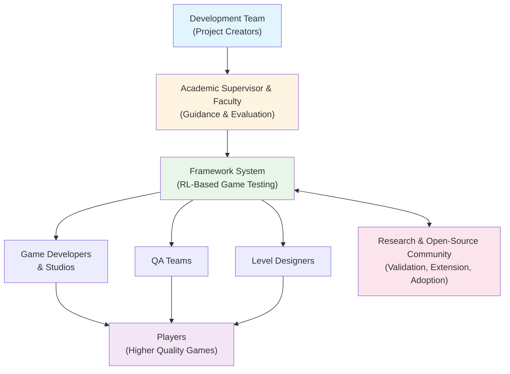

# Faculty of Computing and Information Sciences
# Graduation Project Deliverable #1

---

# **Autonomous Quality Assurance for Game Levels Using Deep Reinforcement Learning: A Framework Demonstration**

## **Team Members:**

| Student ID | Student Name | Track |
|------------|--------------|-------|
|            |              |       |
|            |              |       |
|            |              |       |

**Supervised by:** Prof./Dr. Mohamed Taher  
**Mentored by:** (if existed)

**Date:** January 28, 2026

---

## Table of Contents

1. System Description
   1.1. Problem Statement
   1.2. System Overview
   1.3. System Scope and Limitations
   1.4. System Objectives
   1.5. Stakeholders
   1.6. Project Planning and Management
      1.6.1. Project Timeline Revisited
      1.6.2. Preliminary Budget Adjusted
2. System Development Process/Methodology
3. Requirements Engineering
   3.1. Requirements Elicitation Techniques
   3.2. Similar Systems
      3.2.1. Academic Scientific Research
      3.2.2. Market/Industrial Research
   3.3. Functional Requirements
      3.3.1. System Functions
      3.3.2. Detailed Functional Specification
      3.3.3. Behavioural Modelling
      3.3.4. Domain/Data Modelling
   3.4. Non-functional Requirements
4. System Design
   4.1. Composition/Architectural Viewpoint
   4.2. Database Design
   4.3. Design Classes and Methods
   4.4. Algorithm Viewpoint
   4.5. Patterns Use Viewpoint
5. Data Design
   5.1. Data Description
   5.2. Dataset Description
6. Implementation
7. Appendices
8. References

---

# 1. System Description

## 1.1. Problem Statement

The video game industry has evolved into an extremely competitive multi-billion-dollar market, with annual revenues reaching approximately $162.32 billion [4]. Despite significant investment and years of development, many titles fail commercially due to "game-breaking bugs" that disrupt gameplay and ruin the player experience. A prominent example is the launch of *Cyberpunk 2077*, which resulted in a 75% drop in the developer's stock value due to unaddressed quality issues [5].

The core of this problem lies in the limitations of current quality assurance (QA) practices, which remain heavily dependent on manual playtesting. Contemporary research indicates that "manual approaches towards game testing are still widely used" across the industry despite their inherent limitations [1]. This reliance on human effort introduces three critical challenges that this framework aims to address:

### **Challenge 1: Scalability and Time Constraints**

Manual testing requires human testers to repeatedly play through game levels to validate playability and find bugs, a process that scales poorly with modern development demands. This is particularly problematic for:

- **Procedural content generation** that creates thousands of unique levels requiring validation before player exposure
- **Live-service games** that require rapid QA turnaround for frequent content updates
- **Independent developers** who often lack resources for dedicated QA teams, leading to insufficiently tested content reaching end-users
- **Iterative design cycles** where each modification necessitates complete manual re-testing

Industry data suggests that developers may allocate 30% to 40% of their total development time to QA tasks alone [6], creating substantial bottlenecks in production schedules and constraining development budgets.

### **Challenge 2: Subjectivity and Inconsistency**

Human assessments of game difficulty and quality are inherently subjective, influenced by individual skill levels, cognitive fatigue, and personal biases. The absence of standardized, quantitative metrics for difficulty assessment makes it difficult for designers to make reliable, data-driven decisions during iterative development cycles. Different testers frequently provide inconsistent evaluations of identical content, yielding unreliable feedback for game balance refinement.

### **Challenge 3: Incomplete Coverage and Bug Detection**

Human testers face fundamental cognitive and temporal limits in exploring the vast state spaces of modern games. Manual testing frequently fails to explore non-obvious gameplay paths and interaction sequences, leaving bugs undetected until they reach end-users. Recent taxonomic analysis identified **63 distinct categories of game bugs**—including navigational faults, gaming balance issues, temporal state errors, implementation response failures, and unexpected crashes—demonstrating the complexity and diversity of quality issues that manual testing must address [1]. These limitations result in critical defects remaining latent in shipped products, negatively impacting player experience, review scores, and commercial success.

---

### **Proposed Solution: RL-Based Automated Testing Framework**

This project presents a **generalizable framework for automated game level quality testing using Deep Reinforcement Learning agents**, demonstrated through a Doom implementation as proof-of-concept. The increasing complexity of modern video games is pushing the limits of traditional scripted automation, necessitating the adoption of more advanced, autonomous testing strategies [3]. The core methodology addresses the identified challenges through systematic automation:

**Addressing Challenge 1 (Scalability):** RL agents execute autonomous level testing without human intervention, enabling parallel testing workflows and continuous integration pipelines. Agents operate at computational speeds orders of magnitude faster than real-time human gameplay, substantially reducing testing cycle durations.

**Addressing Challenge 2 (Objectivity):** The framework generates quantitative, deterministic metrics including precise event counts, temporal measurements, resource consumption patterns, and algorithmically computed difficulty scores on normalized scales. These objective measurements enable consistent cross-level comparisons and evidence-based design iteration.

**Addressing Challenge 3 (Coverage):** Automated agents can execute thousands of gameplay iterations, systematically exploring state spaces through stochastic policies. Algorithmic analysis of gameplay telemetry identifies anomalous patterns indicative of bugs (stuck states, anomalous state transitions, unreachable regions) with detection capabilities beyond manual testing constraints. Prior research demonstrates that RL-based synthetic and humanlike agents achieve bug-finding performance competitive with human testers while providing exhaustive coverage [2].

---

### **Research Contribution and Generalizability**

While this implementation utilizes Doom via the VizDoom platform as the research testbed—selected for its mature RL tooling ecosystem, availability of pre-trained agents, and extensive research precedent in the RL community—**the core methodology is engine-agnostic and architecturally transferable to contemporary game engines** including Unity, Unreal Engine, Godot, and proprietary platforms.

The framework employs a modular architecture with clear separation between:
- **Game engine adapters** (implementation-specific interface layer)
- **Core testing logic** (engine-independent analysis and orchestration)
- **Data infrastructure** (fully generalizable database schema and query system)

Preliminary architectural analysis indicates that engine-specific code (game interaction modules) constitutes approximately **39%** of the total implementation, suggesting that **approximately 61% of the infrastructure is directly reusable** for alternative game engine adaptations. This modular separation enables systematic extension to additional platforms through targeted adapter development while preserving the majority of analytical and infrastructure components.

This research demonstrates the technical feasibility and practical viability of RL-based automated game testing, providing a methodological blueprint applicable across diverse game engines and genres. The system addresses a critical gap between academic RL research and applied game development requirements, offering evidence-based validation for AI-powered quality assurance adoption in production environments.

---

**Formal Problem Statement:**

*How can we develop an automated, objective, and scalable framework for game level quality testing that substantially reduces QA cycle duration, provides quantitative difficulty metrics with inter-rater reliability, systematically detects bugs through telemetry analysis, and maintains architectural generalizability across multiple game engine platforms?*

---

## References (Preliminary)

[1] N. A. Butt, S. Sherin, M. U. Khan, A. A. Jilani, and M. Z. Iqbal, "Deriving and Evaluating a Detailed Taxonomy of Game Bugs," arXiv:2311.16645 [cs.SE], Nov. 2023. [Online]. Available: https://arxiv.org/abs/2311.16645

[2] S. Arıyürek, A. Betin-Can, and E. Sürer, "Automated Video Game Testing Using Synthetic and Humanlike Agents," IEEE Transactions on Games, vol. 13, no. 1, pp. 50-67, Mar. 2021, doi: 10.1109/TG.2019.2947597.

[3] V. Mastain and F. Petrillo, "BDD-Based Framework with RL Integration: An approach for videogames automated testing," arXiv:2311.03364 [cs.SE], Oct. 2023. [Online]. Available: https://arxiv.org/abs/2311.03364

[4] [CITATION NEEDED: Industry revenue statistics - Source required from ESA/Newzoo/Statista]

[5] [CITATION NEEDED: Cyberpunk 2077 case study - Source required from business/gaming news]

[6] [CITATION NEEDED: QA time allocation statistics - Source required from game development surveys/GDC reports]

---
## 1.2. System Overview

The proposed framework implements a fully automated pipeline for game level quality assurance, structured as a modular architecture that separates engine-specific adapters from core analytical logic. This design enables extensibility across multiple game engines while maintaining a unified testing methodology.

### System Architecture

The system operates through eight interconnected stages, illustrated in Figure 1:

```
┌────────────────────────────────────────────────────────────────────┐
│                    SYSTEM ARCHITECTURE OVERVIEW                     │
└────────────────────────────────────────────────────────────────────┘

 ┌─────────────────────┐
 │ 1. Game Content     │   
 │    (.wad files)     │ ← Custom Doom maps for testing
 └──────────┬──────────┘
            │
            ↓
 ┌─────────────────────┐
 │ 2. Game Engine      │
 │    Adapter          │ ← VizDoom (Doom), Unity, Unreal (future)
 │   (VizDoom API)     │
 └──────────┬──────────┘
            │
            ↓
 ┌─────────────────────┐
 │ 3. RL Agent         │
 │    (DQN Network)    │ ← Autonomous gameplay execution
 │   [PyTorch-based]   │    Generates gameplay video frames
 └──────────┬──────────┘
            │
            ↓
 ┌─────────────────────┐
 │ 4. Computer Vision  │
 │    Bug Detection    │ ← CV model analyzes gameplay footage
 │  [CNN/YOLO-based]   │    Detects crashes, glitches, visual bugs
 └──────────┬──────────┘
            │
            ↓
 ┌─────────────────────┐
 │ 5. Metrics          │
 │    Extraction       │ ← Deaths, time, health, events
 │    Module           │    + CV-detected anomalies
 └──────────┬──────────┘
            │
            ↓
 ┌─────────────────────┐
 │ 6. PostgreSQL       │
 │    Database         │ ← Persistent storage (engine-agnostic schema)
 │   [+ JSONB support] │
 └──────────┬──────────┘
            │
            ↓
 ┌─────────────────────┐
 │ 7. Query & Analysis │
 │    API Layer        │ ← REST API for data retrieval
 └──────────┬──────────┘
            │
            ↓
 ┌─────────────────────┐
 │ 8. Visualization    │
 │    Dashboard        │ ← Web interface for QA analysts
 └─────────────────────┘

┌──────────────────────────────────────────────────────────────┐
│ GENERALIZABILITY LAYER SEPARATION                            │
├──────────────────────────────────────────────────────────────┤
│ • Layers 1-3: ENGINE-SPECIFIC (requires adapter per engine) │
│ • Layers 4-8: ENGINE-AGNOSTIC (fully reusable)              │
└──────────────────────────────────────────────────────────────┘
```

**Figure 1:** System architecture demonstrating the adapter pattern with integrated computer vision for automated bug detection. Only the Game Engine Adapter (Layer 2) requires modification when extending the framework to new platforms (Unity, Unreal, Godot). Core testing logic, CV detection, database infrastructure, and visualization remain unchanged.

### Architectural Components

**Layer 1: Game Content Input**  
Accepts game levels in native format (.wad files for Doom; Unity scenes, Unreal maps for future extensions). The framework processes these files through the appropriate engine adapter without modification to the original content.

**Layer 2: Game Engine Adapter**  
The **engine-specific abstraction layer** provides a unified interface to the RL agent regardless of underlying game engine. For the Doom implementation, this leverages the VizDoom Python API, which exposes game state observations and action execution capabilities. Future adapters for Unity or Unreal Engine would implement the same interface contract, enabling drop-in engine substitution without modifying downstream components.

**Layer 3: RL Agent**  
A Deep Q-Network (DQN) agent executes autonomous gameplay, trained on diverse game scenarios to navigate levels using pixel-based visual input and discrete action commands. The agent operates in evaluation mode (no learning during testing), ensuring deterministic performance suitable for repeatable QA runs. During execution, the agent generates continuous gameplay footage (frame sequences) that serve as input to the computer vision detection system. Agent architecture remains engine-agnostic—the same neural network structure can process observations from any game engine provided appropriate preprocessing in Layer 2.

**Layer 4: Computer Vision Bug Detection**  
A convolutional neural network (CNN) or YOLO-based object detection model analyzes gameplay video frames in real-time to identify visual anomalies and implementation faults. This layer provides automated, pixel-level bug detection capabilities:

- **Crash Detection:** Identifies frozen frames, black screens, error message overlays, and application termination patterns
- **Visual Glitches:** Detects graphical corruption (missing textures, z-fighting, clipping errors), rendering artifacts, lighting anomalies
- **UI Anomalies:** Recognizes misaligned interface elements, text overflow, overlapping menus, missing HUD components
- **Animation Errors:** Identifies stuck animations, incorrect state transitions, T-pose defaults, skeletal deformation failures
- **Physics Violations:** Detects clipping through geometry, floating objects, incorrect collision responses
- **Game State Anomalies:** Recognizes stuck-state indicators (static camera despite input), unreachable areas (agent collision loops)

The CV model operates frame-by-frame on RGB image inputs (typically 640×480 or higher resolution), producing timestamped anomaly classifications with bounding box coordinates for detected issues. Training data consists of labeled gameplay footage annotated with bug categories from the 63-category game bug taxonomy [1]. This vision-based approach complements telemetry analysis by detecting bugs that manifest visually but may not trigger measurable state changes in game engine APIs.

**Layer 5: Metrics Extraction**  
Telemetry analysis module that transforms raw gameplay traces and CV detection results into quantitative quality indicators:
- **Event counters:** Deaths, item pickups, enemy encounters, checkpoint completions
- **Temporal metrics:** Completion time, segment durations, stuck-state detection timestamps
- **Resource tracking:** Health, ammunition, armor progression timelines
- **Hardness scoring:** Algorithmic computation using weighted death rates, time constraints, resource scarcity
- **Bug classification:** Integration of CV-detected visual anomalies with pattern-matched behavioral bugs (position stagnation, navigation failures, instant deaths)
- **Anomaly timestamps:** Frame-accurate recording of bug occurrence times with severity classifications

This module operates on game-agnostic data structures (event logs, coordinate sequences, resource values, image anomaly reports), requiring no engine-specific knowledge.

**Layer 6: PostgreSQL Database**  
Centralized storage with a schema designed for cross-engine compatibility. Tables represent abstract game concepts (maps, test runs, events, metrics, visual_anomalies) rather than engine-specific constructs. JSONB columns accommodate flexible metadata storage, enabling engine-specific extensions without schema migrations. The database stores both telemetry data and CV detection results with frame-accurate timestamps, supporting historical analysis, comparative queries, and regression detection across testing sessions.

**Layer 7: Query & Analysis API**  
REST API exposing structured queries for:
- Map comparison (difficulty ranking, bug frequency, visual anomaly rates)
- Timeline reconstruction (frame-by-frame playback analysis with bug annotations)
- Statistical aggregation (mean completion times, death rate distributions, crash frequencies)
- Regression detection (comparing current tests against baseline data)
- CV anomaly filtering (by bug type, severity, temporal clustering)

**Layer 8: Visualization Dashboard**  
Web-based interface presenting:
- Comparative difficulty charts
- Bug occurrence heatmaps with CV-detected visual anomalies
- Agent trajectory overlays on level layouts
- Temporal performance graphs
- Annotated gameplay video playback with detected bug timestamps

---

### Design Rationale: Generalizability Through Abstraction

The **adapter pattern** is central to the architecture: only Layer 2 (Game Engine Adapter) contains engine-specific code. This 39% implementation-specific component isolates all platform dependencies, while the remaining 61% of the system operates on abstract game primitives (positions, events, resources, visual frames) that exist in all game genres.

**Path to Unity/Unreal Extension:**  
1. Implement new adapter class adhering to the `GameEnvironment` interface
2. Map Unity/Unreal concepts to abstract primitives (transform positions → coordinates, health components → resource values, scene events → event logs)
3. Train/fine-tune CV model on Unity/Unreal-specific visual styles (optional, transfer learning from Doom baseline)
4. Retain all downstream components unchanged (Layers 4-8)

This modular design positions the framework as a **methodology reference implementation** rather than a Doom-specific tool, demonstrating production viability of RL-based automated testing for the broader game development industry.

---

## 1.5. Stakeholders

This section identifies the key stakeholders involved in or affected by the automated game quality assurance framework project.

### Stakeholder Categories

**Primary Stakeholders (Direct Involvement)**

1. **Development Team**
   - Role: Design, implement, test, and document the framework
   - Interest: Successful project completion, skill development in RL and software engineering

2. **Academic Supervisor (Prof./Dr. Mohamed Taher)**
   - Role: Provide guidance, review deliverables, evaluate project quality
   - Interest: Academic rigor, research contribution, student learning outcomes

3. **Faculty Review Committee**
   - Role: Assess deliverables and implementation against graduation requirements
   - Interest: Project meets academic standards and demonstrates technical competency

**Direct Beneficiaries**

4. **Game Developers & Studios**
   - Role: Potential adopters of the framework for production QA workflows
   - Interest: Reduced testing time, objective difficulty metrics, automated bug detection
   - Scope: Indie developers, AA/AAA studios, procedural content generation teams

5. **QA Teams & Testers**
   - Role: End-users of the framework; integration into existing QA pipelines
   - Interest: Augmentation of manual testing capabilities, faster iteration cycles

6. **Level Designers**
   - Role: Consumers of difficulty metrics and bug reports
   - Interest: Data-driven design decisions, rapid quality feedback during iteration

**Secondary Stakeholders**

7. **Research Community**
   - Role: Validate methodology, replicate experiments, extend to other domains
   - Interest: Reproducible results, open-source access, academic publication potential

8. **Open-Source Community**
   - Role: Contribute extensions (Unity/Unreal adapters), report issues, improve documentation
   - Interest: Accessible codebase, clear documentation, modular architecture

**Indirect Stakeholders**

9. **Game Players (End-Users)**
   - Role: Benefit from higher-quality games with fewer bugs
   - Interest: Improved gameplay experience, fewer game-breaking issues at launch

10. **Game Industry at Large**
    - Role: Adoption of AI-driven QA practices as standard methodology
    - Interest: Industry-wide quality improvement, reduced development costs

---

### Stakeholder Relationship Diagram



**Figure 2:** Stakeholder ecosystem showing relationships between project creators, direct beneficiaries, and the broader game development community. Arrows indicate flow of value: guidance from academia, implementation by development team, utilization by game industry professionals, and ultimate benefit to players.

---

### Stakeholder Engagement

| Stakeholder | Engagement Method | Deliverables/Touchpoints |
|-------------|-------------------|--------------------------|
| **Development Team** | Daily collaboration, version control | Code commits, documentation, testing |
| **Academic Supervisor** | Weekly meetings, milestone reviews | Deliverable documents, progress reports |
| **Game Developers** | Documentation, open-source release | GitHub repository, usage guides, API docs |
| **QA Teams** | User guides, integration documentation | REST API specs, error handling guides |
| **Research Community** | Academic paper, open-source code | Reproducibility package, methodology documentation |
| **Players** | Indirect (via improved games) | No direct engagement |

---