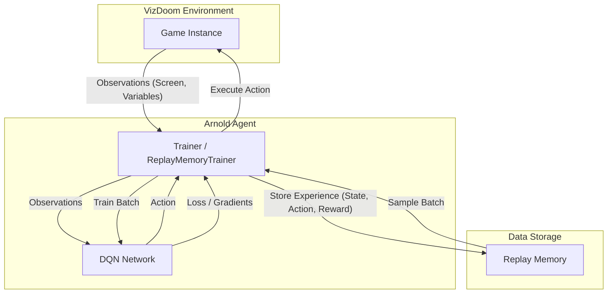
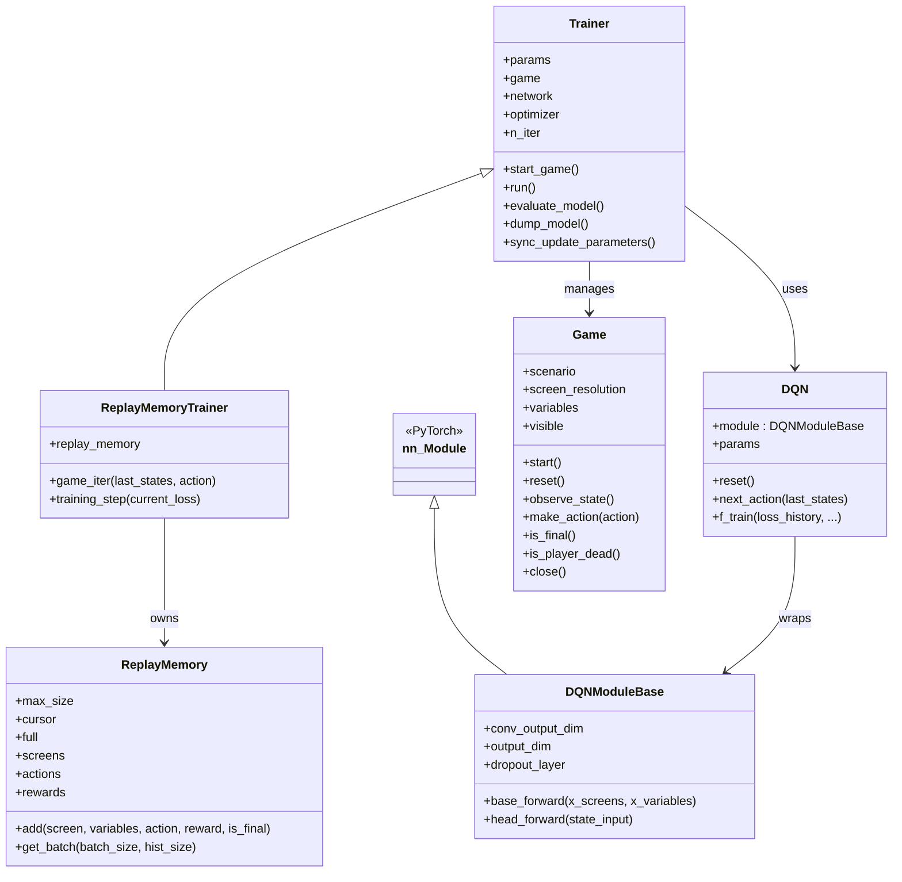
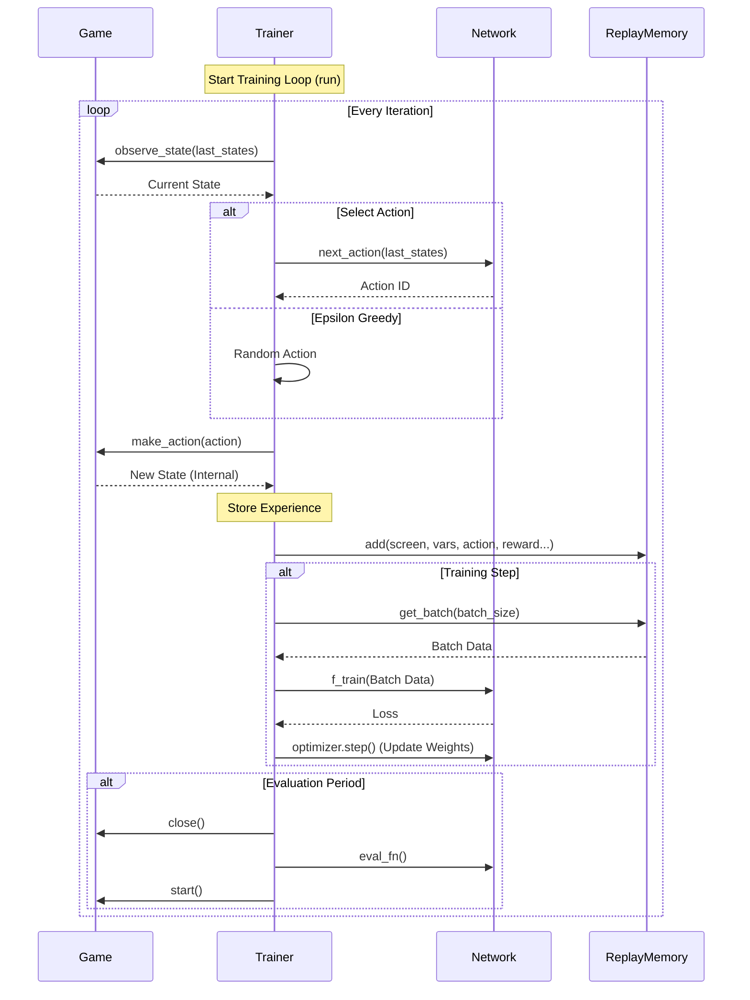

# Arnold Project Documentation Diagrams

This document contains diagrams documenting the architecture, class structure, and execution flow of the Arnold Reinforcement Learning agent.

## 1. System Architecture Diagram

This diagram illustrates the high-level interaction between the main components: the Agent (Trainer & Model), the Environment (VizDoom), and the Data Storage (Replay Memory).

## 2. UML Class Diagram

This diagram details the static structure of the codebase, showing the relationships and inheritance between the core classes found in `src/trainer.py`, `src/doom/game.py`, `src/replay_memory.py`, and `src/model/dqn/base.py`.

## 3. Sequence Diagram (Training Loop)

This diagram visualizes the critical path of the `run()` method in `Trainer.py`, showing how the system executes a single training iteration.

